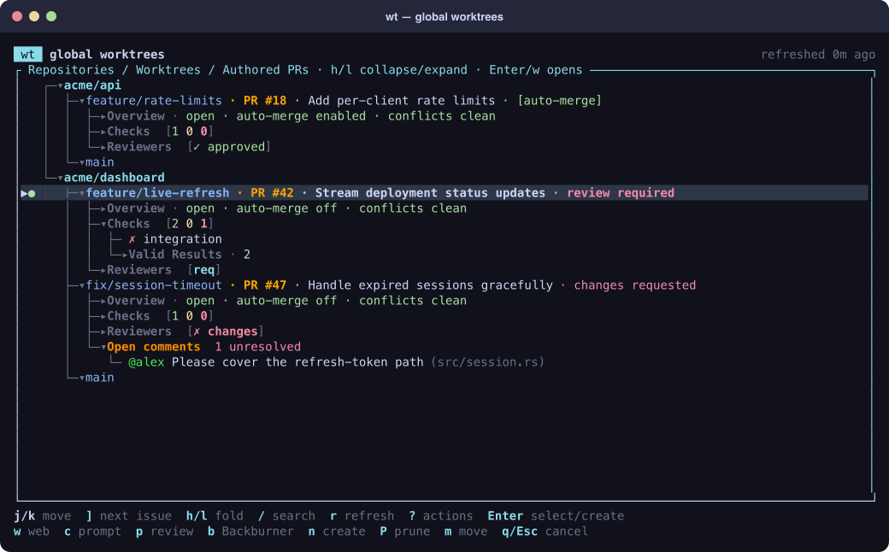

# wt

`wt` is a global Git worktree manager for seeing active development at a glance and jumping straight into the branch that needs attention. It combines worktree navigation, creation, cleanup, and GitHub pull-request status in one terminal UI.



_Screenshot generated from fictional repositories and pull-request data._

## Features

- **See all active development in one place.** Browse worktrees across every registered repository alongside branch dirtiness, pull requests, checks, reviews, unresolved comments, conflicts, and stacked work.
- **Use it like `cd`.** Load the Bash or Zsh integration, navigate to a worktree, and press Enter; `wt` changes the current shell to that directory. Unique repository-qualified selectors work directly from the command line too.
- **Create worktrees quickly.** Press `n` for the common tracked-worktree flow, materialize an authored pull request that is not local yet, or use scriptable commands for advanced creation.
- **Hand failures to an agent.** Press `c` on a failed check, review comment, pull request, stack, or repository to copy a scoped, agent-ready follow-up prompt with IDs, URLs, and reusable `gh api` commands.
- **Keep attention focused.** Search every visible and hidden detail, jump between actionable pull requests, copy review-request links, and move lower-priority work to the Backburner.
- **Operate safely.** Preview and confirm mutations, refuse unsafe removal by default, and clean up merged worktrees only after live GitHub and local-state revalidation.

Local repository and worktree data renders first. The most recent GitHub snapshot is loaded from a machine-local cache for the first frame, then status and GitHub requests run in the background. Unavailable repositories, missing credentials, network failures, and rate limits do not block navigation or local operations.

## Installation

`wt` requires Git and a current Rust toolchain. Install the latest release from crates.io:

```bash
cargo install wtui
```

To install the latest development version directly from GitHub:

```bash
cargo install --git https://github.com/wbbradley/wt.git
```

To install from an existing checkout instead:

```bash
cargo install --path .
```

Confirm that Cargo's binary directory is on `PATH` and the installation is available:

```bash
command -v wt
wt --version
```

Rustup normally configures `~/.cargo/bin` automatically. If `command -v wt` prints nothing, add this before the shell-initialization line in the same startup file:

```bash
export PATH="$HOME/.cargo/bin:$PATH"
```

### Shell initialization

Add one line to your shell startup file:

```bash
# Bash
eval "$(wt shell-init bash)"

# Zsh
eval "$(wt shell-init zsh)"
```

Restart your shell to load the navigation wrapper and tab completion.

### First run

Register repositories, including normal checkouts, linked worktrees, and bare repositories:

```bash
wt repo add ~/src/project --label project
wt repo add ~/src/service.git --label service
wt repo list
```

Running `wt` opens the global TUI. Running it inside an unregistered Git repository also shows that repository as session-only; press `a` to register it. An empty catalog displays onboarding instructions.

Run `wt -x` from a linked worktree when you are finished with it. `wt` safely removes the containing worktree only when it is clean and unlocked, relocates to the registered repository anchor (or `$HOME` if the anchor is unavailable), and then opens the TUI normally. The main worktree and bare anchors remain protected. If the TUI is cancelled after a successful cleanup, the shell still moves to that fallback directory.

## Shell navigation and completion

The integration supports Bash 3.2 and Zsh. With the function loaded, `wt` changes the current shell to the worktree selected in the TUI. Cancellation, an empty selection, and failures leave `$PWD` unchanged. Scriptable `config`, `repo`, and `worktree` commands plus shell initialization, help, and version requests pass directly to the binary.

Navigate without opening the TUI when a branch, worktree basename, or path is unique:

```bash
wt project:feature/login
wt project:project-login
wt project:/absolute/path/to/project-login
```

An ambiguous qualified selector opens the TUI prefiltered instead of guessing. Tab completion is local-only: it completes commands, flags, repository labels, qualified selectors, branches, and paths without contacting GitHub or opening the TUI. Spaces in paths are preserved.

## TUI

The initial selection is the worktree containing the current directory. The body is one full-width, selectable tree: repositories own local worktree and virtual pull-request branches, and every branch's metadata and attention details are inline. GitHub commit associations are candidates: an exact PR head-branch match wins, followed by an exact head-SHA match, before the open/newest fallback. A local row suppresses only that selected PR; every other authored PR remains virtual, so changing or removing a worktree cannot erase the rest of its remote stack. Local commit ancestry wins when it disagrees with GitHub stack ancestry, and each remaining virtual PR is attached once by an unambiguous base/head relationship.

```text
  └─▾acme/web
●    ├─▾feature/login · [~1] · PR #42 · Fix login race · checks failing · review required
     │  ├─▸Overview · open · auto-merge off · conflicts clean
     │  ├─▸Checks  ✗ 3/4 required
     │  ├─▸Reviewers  [req, ✗ changes]
     │  ├─▾Open comments  2 unresolved
     │  │  └─ @reviewer Handle cancellation (src/login.rs) [outdated]
     │  └─▾Stacked branches
     │     └─▾feature/login-ui · PR #43 · Polish login UI · virtual-only
     ├─▾chores
     └─▸Backburner
```

Every row starts with a fixed two-column location gutter: the containing worktree has a green `●` followed by a space, while every other row has two blanks, keeping tree content aligned. Top-level repositories use `┌─`, `├─`, and `└─` connectors according to sibling position. At every depth, collapsible rows fill the connector's trailing column with `▾` or `▸`, producing forms such as `├─▾branch` without shifting the label. Tree connectors and disclosures are muted, PR numbers are orange, reviewer names have stable hash-derived colors, and every tree item stays on one display-width-truncated line. Branch rows show title and compact attention status: failed required checks, outstanding or changes-requested reviews, actual conflicts, auto-merge, non-open state, virtual/Backburner state, and local status. Merged associations retain only the compact `merged` state, omitting their PR number and title. Unresolved counts live on the Open comments header instead of being repeated on the branch. `[+N ~N ?N]` means staged, unstaged, and untracked entries; `locked` and `prunable` remain explicit.

A non-bare repository with exactly one worktree omits the separate branch row and renders in the location gutter as `● repository (branch)`, followed immediately by local status when dirty. Its PR details become direct children; a clean non-PR singleton therefore occupies one selectable line. Bare and multi-worktree repositories retain the full repository → branch hierarchy.

Disclosure defaults match Rollup while retaining `wt`'s local metadata:

- repositories, complete branch subtrees, Open comments, and Stacked worktrees/PRs/branches start expanded;
- Overview, Checks, Pending, Valid Results, Reviewers, and Backburner start collapsed;
- Overview expands to URL, base/head, full head SHA, state/update time, auto-merge, conflict, warning, and stale/loading detail state;
- Checks keeps failure/error and unknown rows direct, Pending/Expected under Pending, and successful/neutral/skipped rows under Valid Results;
- Reviewers combines requests and latest submitted states without review-body children; Open comments is the only feedback subtree and contains unresolved inline threads only.

A worktree at a merged PR's merge commit can still carry that GitHub association and the compact `merged` branch label. Merged associations omit Overview, Checks, and Reviewers; Open comments remains only when unresolved threads still exist.

Navigation:

- `j`/`k` or arrows move across every visible row; `g`/`G` select first/last; `Ctrl-d`/`Ctrl-u` move half a full-tree viewport.
- `h`/Left collapses a selected disclosure. On a metadata, check, reviewer, or comment leaf it collapses the nearest enclosing section and lands on its header. A branch targets its complete subtree.
- `l`/Right expands a disclosure and is a no-op on leaves. Inner fold choices survive outer folds and refreshes.
- `]`/`[` moves to the next/previous actionable non-Backburner PR, wraps, and reveals only its required ancestor path.
- `Enter` toggles a repository/disclosure, selects a local worktree, materializes a virtual PR, or opens an inline URL with PR fallback. `w` opens the selected item or owning PR in a browser.
- `r` coalesces local and GitHub refreshes. `?` or Space opens the action palette. `q`/`Esc`/`Ctrl-c` cancels; during materialization, Ctrl-C stops the active process and returns to the TUI.

Press `/` to edit a case-insensitive search regular expression. It searches rendered repository, branch, section, reviewer, comment, and check text plus hidden paths, SHAs, URLs, warnings, IDs, and status/error values. Matching updates incrementally, highlights visible matches in black on yellow, and retains only exact matching rows plus their complete ancestor paths; an incomplete or invalid expression shows no rows until it becomes valid. Enter commits the search as a worktree/branch pruner: repositories and branches without matches stay hidden, while every detail row under each matching branch is restored. Search preserves saved folds, expanding only the paths needed to expose exact hits, and has its own temporary `h`/`l` overrides. `/` replaces it and Esc clears it, restoring the exact saved tree choices.

Direct actions:

- `c`: copy an agent-ready prompt for the selected exact item, class section, branch subtree, repository, or Backburner scope.
- `p`: copy one `{url} - {title}` review-request line per PR in the same structural scope.
- `b`: toggle the selected PR and GitHub-stacked descendants in Backburner.
- `n`: common tracked-worktree creation; `m`: move; `L`/`U`: lock/unlock; `d`: remove; `R`: repair; `P`: prune. Advanced create remains available in the action palette.
- `a`: register a session repository; `e`: edit/relink; `x`: unregister; `w`: open the associated PR/item URL.

All actions remain in the palette, disabled entries explain why, and mutating forms show exact inputs before a separate confirmation. `n` pre-fills `<github-user>/`, accepts an optional starting branch, and defaults a blank start to the preferred remote's trunk. A successful tracked-worktree creation exits so the shell wrapper can enter it.

For `c`, a check or comment row is exact, including an individually selected passing check. Checks selects failing checks only, Open comments selects unresolved inline comments only, Reviewers selects review summaries, and a reviewer selects that reviewer's summaries. Container scopes include failing checks and unresolved inline comments, never historical review summaries: a branch includes itself and descendants; Stacked branches excludes the parent; a repository excludes Backburner; and Backburner selects its represented subtrees. Scope ignores current folds and filters, deduplicates canonical identities, and retains tree pre-order. The copied prompt follows Rollup's grouped `In branch (#PR title)` format, provides a shell-safe `cd` command for the mapped worktree, reports its checked-out branch and local HEAD relative to the PR head, lists stored comment/review IDs with reusable `gh api` commands, and includes check URLs. Empty scopes report `c: nothing to address here` without changing the clipboard.

For `p`, a leaf or non-stacking section selects its owning PR and container scopes mirror `c`. Leading conventional-commit prefixes are removed and drafts end in ` - DRAFT`. A truly empty scope reports `p: no PR under selection` without changing the clipboard.

```text
In feature/login (#42 Fix login race):

Use this existing checkout:
```bash
cd -- '/Users/me/src/web-login'
```
Branch `feature/login` is checked out there. Local HEAD `98c549d2` matches the PR head.

Checks:
  - integration (https://github.com/acme/web/actions/runs/123)
```

Authored PRs are grouped under their canonical base `owner/repository`. `[no local repo]` means the base repository is not registered; `virtual-only` means no local worktree represents that PR. Enter materializes a virtual row after a live SHA recheck. Ordinary worktree actions and direct selectors never materialize implicitly.

Backburner membership is host-aware and persisted in `$XDG_STATE_HOME/wt/state.json` (normally `~/.local/state/wt/state.json`; override with `WT_STATE_PATH`). A backburnered branch moves under the final collapsed Backburner group together with its complete represented subtree, including local worktrees and descendants discovered after membership was saved. Explicit navigation and `c`/`p` remain available, while repository prompts and attention traversal skip them.

Local worktrees are nested by nearest commit ancestry. Local ancestry takes precedence over pull-request stack metadata, and each branch is rendered only once. Worktrees are always enumerated from each tracked repository's centralized `git worktree list --porcelain` data, including linked worktrees outside configured roots.

## Scriptable worktree operations

Inspect or list without opening the TUI:

```bash
wt worktree list
wt worktree inspect project feature/login
```

Creation supports an existing unattached branch, a new branch with a start point, or a detached commit:

```bash
wt worktree create project --branch existing-branch
wt worktree create project ~/trees/new --new-branch new --start-point main
wt worktree create project ~/trees/review --detach abc123 --create-parents
```

Mutating commands print an exact preview and prompt unless `--yes` is supplied where supported. See `wt worktree --help` for move, lock, unlock, repair, remove, force-remove, prune-preview, and prune syntax.

Remove clean linked worktrees whose exact checked-out commits are the recorded heads of merged pull requests:

```bash
wt worktree remove-merged project
wt worktree remove-merged --all
wt worktree remove-merged --all --yes
```

`remove-merged` performs live GitHub requests and prints every eligible worktree and refusal before one confirmation. It uses a branch's canonical materialization marker when present; otherwise the exact commit must have one unambiguous associated PR. The command does not trust cached TUI data.

### Safety rules

- Normal removal refuses bare anchors, main worktrees, the worktree containing `$PWD`, locked worktrees, and dirty worktrees.
- Top-level `wt -x` is the explicit exception for the worktree containing `$PWD`; it retains the bare, main, locked, and dirty protections.
- Removal does not delete the branch.
- Merged-PR cleanup additionally requires a live `merged` PR whose `headRefOid` exactly equals the worktree's current HEAD. It refuses ambiguous associations, missing or partial GitHub data, local changes including untracked files, locks, main/bare/detached/current/prunable worktrees, and any candidate that changes before execution. It revalidates each candidate and never escalates to force removal.
- Force removal is a distinct command and requires `--confirm` to exactly match the branch or full worktree path.
- Missing parent directories at or below a repository's configured `worktree_root` are created automatically; anywhere else they need `--create-parents`.
- Prune displays `git worktree prune --dry-run --verbose` output and confirms the same preview before acting.
- Prune only removes stale Git administrative records; `remove-merged` is the separate command that removes live worktree directories while preserving their local branches and PR markers.
- Catalog removal only unregisters metadata; it never deletes a repository or worktree.
- Git is always invoked with argument arrays rather than shell command strings.

Bare repositories are marked `[bare]` on their repository header; only their navigable linked worktrees appear as children. Create, prune, and catalog operations work from the repository header, while checkout-only actions apply to linked worktrees.

## Catalog and configuration

The default catalog is `~/.config/wt.json`. Set `WT_CONFIG_PATH` to use a different file. Writes are atomic and create missing parent directories. Missing repositories remain visible as `[stale]`; paths that exist but are not usable Git repositories appear as `[invalid]`. Either can be relinked with `wt repo edit ... --path ...` or unregistered without touching the old filesystem path.

Example:

```json
{
  "version": 1,
  "repository_root": "~/src",
  "github_hosts": ["github.com", "ghe.example.com"],
  "github_refresh_interval_secs": 300,
  "repositories": [
    {
      "path": "/Users/me/src/project",
      "label": "project",
      "worktree_root": "/Users/me/src/worktrees/project",
      "github_remote": "upstream"
    }
  ]
}
```

`label`, `worktree_root`, `github_remote`, `repository_root`, and `github_hosts` are optional. `repository_root` defaults to `~/src` and is where unmapped authored-PR repositories are bootstrapped. Its leading `~`, `$VAR`, or `${VAR}` is expanded without evaluating shell syntax; relative paths, undefined variables, command substitutions, and existing non-directory roots are rejected. A configured `worktree_root` supplies the suggested destination for `wt worktree create` and is created on first use if it does not exist yet. The GitHub refresh interval defaults to 300 seconds and is clamped to a minimum of 30 seconds.

Catalog mutations use a sidecar lock next to the JSON file. PR materialization holds that lock continuously from repository bootstrap through registration, fetch, branch preparation, and linked-worktree creation. The TUI remains responsive and shows `waiting for catalog lock` while another process owns it.

## GitHub and GitHub Enterprise

For each local branch, `wt` prefers its configured upstream remote, then the catalog's `github_remote`, then `origin`. SSH and HTTPS remotes for `github.com` and GitHub Enterprise are supported. Detached and bare rows do not make PR requests.

At startup and on refresh, `wt` searches each configured or inferred host for open pull requests authored by the authenticated viewer, including drafts. Results arrive progressively in the background, are deduplicated by base repository and PR number, and retain the last complete snapshot if a host/page fails. `github.com` is always included; Enterprise hosts can be listed in `github_hosts` and are also inferred from cached local remotes. Enterprise GraphQL uses `https://<host>/api/graphql`.

Successful authored-PR and local-branch enrichment snapshots are cached in `$XDG_CACHE_HOME/wt/github.json` (or `~/.cache/wt/github.json`) with mode `0600`. Set `WT_CACHE_PATH` to override the location. Cache entries are matched to both worktree path and full branch ref, so changing a checkout cannot display another branch's cached PR. Cache corruption or an unsupported future schema never prevents startup; `wt` falls back to the asynchronous network refresh.

Tokens are resolved per host in this order:

1. `GITHUB_TOKEN`, then `GH_TOKEN`, for `github.com`; or `GITHUB_ENTERPRISE_TOKEN`, then `GH_ENTERPRISE_TOKEN`, for Enterprise hosts
2. repository-local Git config `github.<normalized-host>.token`, then `github.token`
3. `gh auth token --hostname <host>`

For example:

```bash
git -C ~/src/project config --local github.token TOKEN
git -C ~/src/project config --local github.ghe-example-com.token TOKEN
```

Tokens are used only in direct HTTP authorization headers. They are never serialized, logged, or displayed, and `gh api` is never used for data access.

The TUI shows PR number, title, URL, base/head repository and branch, draft/open/merged/closed state, review decision, latest-commit check rollup, update time, warnings, and remaining/reset rate metadata. Requests are bounded and batched with GraphQL variables. Partial data remains usable with visible warnings. Authentication, permission, SSO/SAML, classic-PAT policy, rate-limit, network, malformed-response, and unsupported-remote failures appear inline.

When a refresh fails, the last successful PR data remains visible as stale. Exhausted hosts are not retried until their reset time. Manual, automatic, and post-mutation refreshes coalesce into one background catalog request at a time.

### Authored-PR materialization safety

Before creating anything, `wt` re-fetches the selected PR and its current head SHA. Closed and merged PRs remain materializable while GitHub still exposes them; a missing or inaccessible PR/repository is rejected.

For an unmapped base repository, `wt` tries `<repo>.git`, `<owner>-<repo>.git`, then `<host>-<owner>-<repo>.git` under `repository_root`. Every existing filesystem object—including a broken symlink—is treated as occupied unless its validated Git remotes identify the requested repository. Clones are staged under a marked `.wt-incomplete-clone-*` directory and fetch only the selected PR's base branch, using a bare `--filter=blob:none` clone when supported and falling back to a normal bare clone only when filtering is rejected. The selected head ref is fetched separately and reused without another transfer when its refreshed commit is already local. SSH is tried first, then noninteractive authenticated HTTPS. Tokens travel only in an environment-provided authorization header and are redacted from diagnostics. A validated existing repository is reused; a stale matching catalog entry is relinked without touching its old path or losing its label, worktree root, or preferred remote.

If a local remote represents the PR head repository, `wt` fetches and tracks the real head branch, including fork remotes. Otherwise it fetches the base repository's PR head ref without permanently adding the fork and uses `pr/<number>-<sanitized-head-branch>`. The fetched commit must match the refreshed SHA. A canonical PR marker is stored in branch-specific local Git config. Only an unattached branch whose tip can safely fast-forward is updated; checked-out, ahead, diverged, and other-PR branches are preserved and a disambiguated branch is chosen. A marker never authorizes resetting local commits.

Configured repositories use `<worktree_root>/<sanitized-local-branch>`; otherwise the exact destination is `<repository_root>/<repo>-pr-<number>`. Existing unrelated destinations fail—numeric path suffixes are never guessed. Successful repositories, refs, branches, and worktrees persist if a later stage fails or the PR closes. Cancellation kills the active Git process and its helpers, cleans only marked incomplete clone/worktree artifacts, retains completed safe stages, returns to the TUI, and emits no path, so the invoking shell stays in its original directory.

## Troubleshooting

- **Repository is stale:** relink it with `wt repo edit <label> --path <new-path>`, or unregister it with `wt repo remove <label>`.
- **Repository is invalid:** the configured path exists but is not a usable Git repository. Select it to see the exact path, then relink or unregister it; `wt` will not delete the existing path.
- **No PR data:** verify the selected remote with `git remote -v`, ensure the branch has an upstream when appropriate, and configure a token for that host.
- **Authored PR is missing:** confirm the token resolves to the expected viewer and that its host is present in `github_hosts` or a registered remote.
- **PR materialization is waiting:** another `wt` process holds the catalog sidecar lock; wait or press Ctrl-C to cancel without changing directories.
- **SSO/SAML or classic PAT error:** authorize the token for the organization or use a token type allowed by its policy.
- **Rate limited:** `wt` suppresses requests until the reported reset time while retaining stale data.
- **Removal disabled:** inspect dirtiness, locks, whether the row is the main/bare worktree, and whether it contains the current directory.
- **Shell does not change directory:** ensure the matching `wt shell-init` command runs in the current interactive shell and that `command -v wt` finds the binary.
- **Terminal looks altered after an external kill:** run `reset`. Normal success, cancellation, errors, Ctrl-C, and panics restore raw mode, cursor visibility, and the alternate screen automatically.

## Development checks

```bash
cargo fmt --check
cargo clippy --all-targets --all-features -- -D warnings
cargo test
bash -n shell/wt.bash
zsh -n shell/wt.zsh
```

## License

`wt` is available under the [MIT License](LICENSE).
